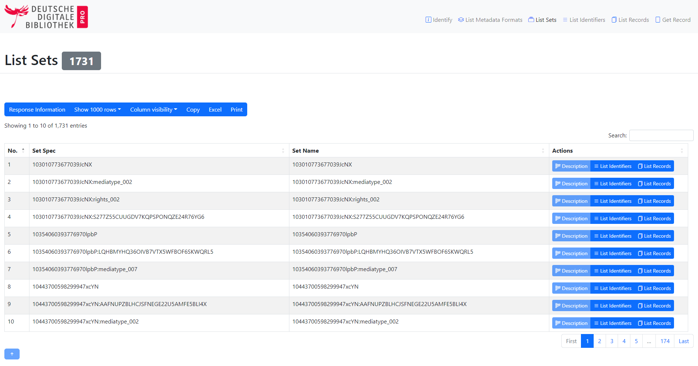

# b4oai - Bootstrap 5 for OAI-PMH responses
This is a [XSL transformations script](b4oai.xsl) for [OAI-PMH](https://www.openarchives.org/OAI/openarchivesprotocol.html) responses. It can be embedded into the responses, like… 
```XML
<?xml version="1.0" encoding="UTF-8" ?>
<?xml-stylesheet type="text/xsl" href="b4oai.xsl"?>
<OAI-PMH xmlns="http://www.openarchives.org/OAI/2.0/" xmlns:xsi="http://www.w3.org/2001/XMLSchema-instance">
    ...
</OAI-PMH>
```
After the transformation work is done (by the requesting browser), you'll get a nice and handy website, which also works on mobile devices (responsive), to view and browse your OAI-PMH response.

## Used libraries and frameworks
All necessary libraries are embedded over Content Delivery Networks (CDN). So there's just one transformation file ([b4oai.xsl](b4oai.xsl)) necessary to beautify your OAI-PMH responses.
- CSS framework [Bootstrap 5.2](https://getbootstrap.com/)
  - [Bootswatch](https://bootswatch.com/) themes can be used as well!
- JavaScript library [jQuery 3.1](https://jquery.com/)
- JavaScript library [Datatables 1.12](https://datatables.net/) for showing the data as tables
- JavaScript library [highlight.js 11.6](https://highlightjs.org/) for XML highlighting
- JavaScript library [popper.js 2.11](https://popper.js.org/) for tooltips

## Feature requests and bugs
Feel free to [open an issue](https://github.com/mbuechner/b4oai/issues/new) at GitHub.

## Credits
This XSLT script is based on an [XSLT script](https://github.com/Daniel-KM/Omeka-plugin-OaiPmhRepository/blob/master/views/public/xsl/oai-pmh-repository.xsl) made by [Daniel Berthereau](https://github.com/Daniel-KM).

## Screenshots
### OAI request: Identify


---
### OAI request: ListMetadataFormats


---
### OAI request: ListMetadataFormats

Datatables is used to display data as tables as many as possible.

---
### OAI request: ListMetadataFormats


---
### OAI request: ListMetadataFormats

Every response has further information, which is displayed in a Bootstrap modal.

---
### OAI request: ListMetadataFormats

The configuration of time spans (parameters `from` and `until`) is supported by the frontend, too.

---
### OAI request: ListMetadataFormats

The XML data of a record is highlighted.
